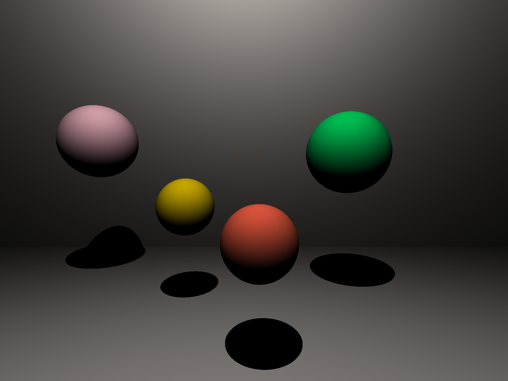

# raytracer
A raytracer written in OCaml. It can draw planes and spheres with diffuse- or mirror-like surface and illuminate them with point & directional light.


### Example rendered scene


### Dependencies
```
$ opam install imagelib
```

### Usage
```
$ make
$ ./main.native
```

### Scene details
You can set camera position, objects & lights in file `scene.json`. Feel free to look at an example in the repo.

Order of keys at this and lower levels of JSON matters and must be the same as in this specification.

First level must have three keys: `camera`, `objects`, `lights`.

#### 1. Camera
A list of seven values:
- `bottom_left_x : float`
- `bottom_left_y : float`
- `upper_right_x : float`
- `upper_right_y : float`
- `resolution_x : int`
- `resolution_y : int`
- `focal_length : float`

Camera is a rectangle on a plane `Z=0`, looking towards vector `(0, 0, 1)`, i.e. looking towards `Z+`. You can set positon of this rectangle (its bottom left and upper right corners), resolution and focal length. The latter is the distance between camera and focus (point through which all the rays from pixels go).

#### 2. Objects
A list of JSON objects, each has the following keys:
- `type`, either `sphere` or `plane`
- `color`, one of the following values: `pink`, `blue`, `green`, `gold`, `seashell`, `tomato`, `black`, `white`, `orchid`, `olive`
- `shader`, either `diffuse` or `mirror` **TODO**
- `data`, a list of floats, depending on object type

Data for `sphere` is a four element list containing:
- `position_x : float`
- `position_y : float`
- `position_z : float`
- `radius : float`

Data for `plane` is a six element list containing:
- `position_x : float`
- `position_y : float`
- `position_z : float`
- `normal_x : float`
- `normal_y : float`
- `normal_z : float`

As plane is given by a point and a normal vector to the plane.

#### 3. Lights
A list of JSON objects, each has the following keys:
- `type`, either `point` or `directional`
- `data`, a four element list of floats, depending on light type

Data for `point` is a list containing:
- `intensity : float`
- `position_x : float`
- `position_y : float`
- `position_z : float`

Point light intensity diminishes with distance from the light. It is inversely proportional to the square of the distance from the source.

Data for `directional` is list containing:
- `intensity : float`
- `direction_x : float`
- `direction_y : float`
- `direction_z : float`

Directional light behaves like the Sun, i.e. it has constant intensity and its source is given by a direction, not a particular point.